# Student Records Management System (SRMS)

A **blockchain-based academic credential system** for issuing, storing, and verifying academic certificates in a secure and tamper-proof manner.

---

## Features

### Admin
- Create and manage student records
- Issue academic certificates and report cards
- Upload:
  - Certificate (PDF)
  - Report Card (PDF)
  - Student Photo (Image)
- Hash academic documents and store verification data on blockchain
- Generate QR codes for issued certificates
- View records and blockchain transaction details

### Student
- Secure authentication
- View personal academic records
- Access issued certificate details
- Share QR code or certificate hash for verification

### Verifier (Public Access)
- Verify certificates using:
  - Certificate hash
  - QR code (file upload or camera scan)
- View verified details:
  - Student name
  - Roll number
  - Department
  - Graduation year
  - Issue date
- Download:
  - Certificate (PDF)
  - Report card (PDF)
  - Student photo

---

## Screenshots

This section provides a visual walkthrough of the **Student Records Management System (SRMS)**, covering admin, student, and public verification workflows.  
All screenshots use demo data only.

---

## 🏠 Home Page

| Home Page |
|----------|
| 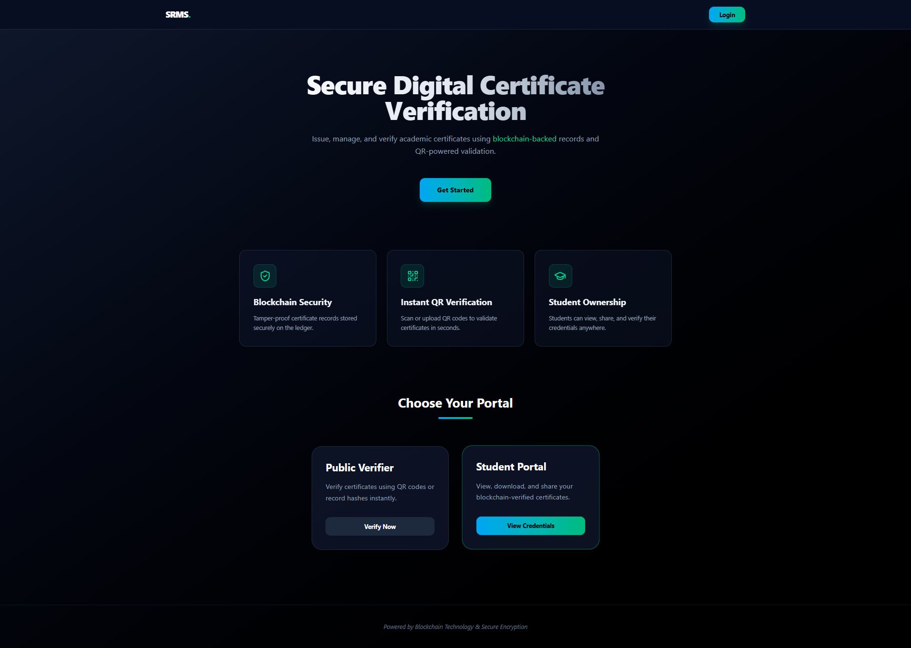 |

---

## 🔐 Authentication

| Login Page |
|-----------|
| 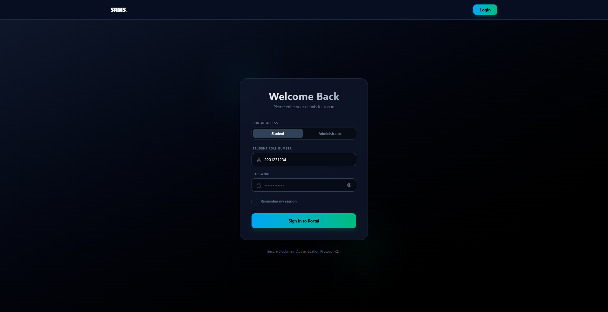 |

---

## 🧑‍💼 Admin Dashboard

| Admin Dashboard |
|-----------------|
| 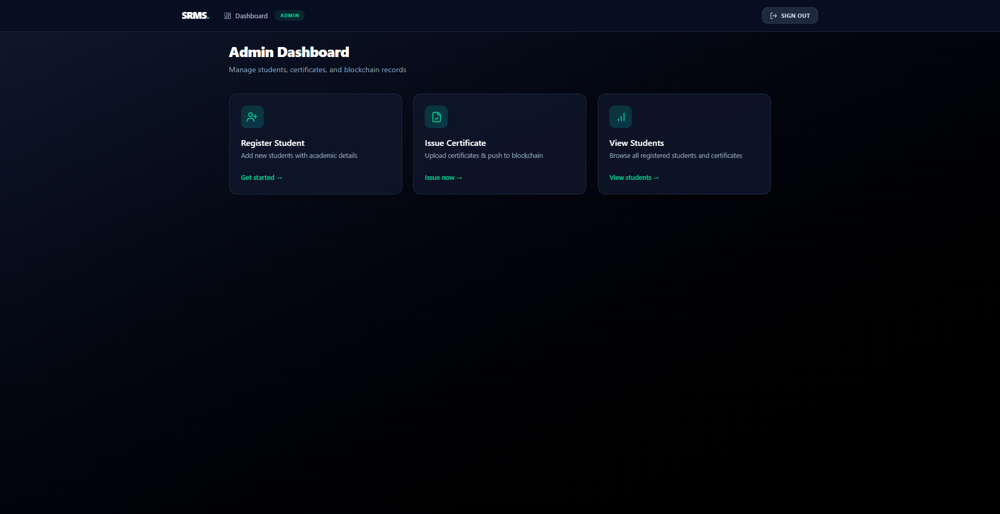 |

---

## 📝 Admin – Register Student

| Register Student |
|------------------|
| 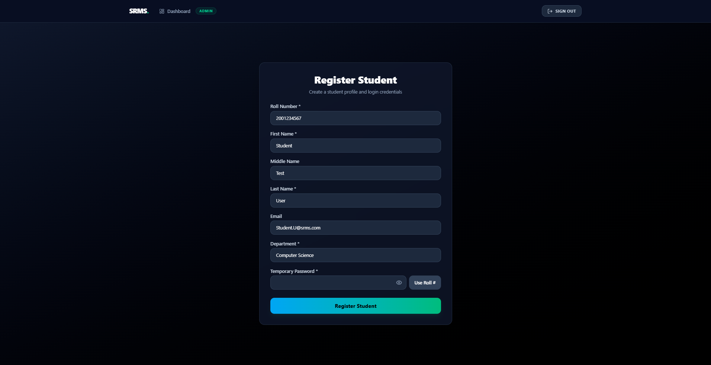 |

---

## 📜 Admin – Issue Certificate Flow

| Select Student & Upload Files | Enter Academic Details |
|-------------------------------|------------------------|
| 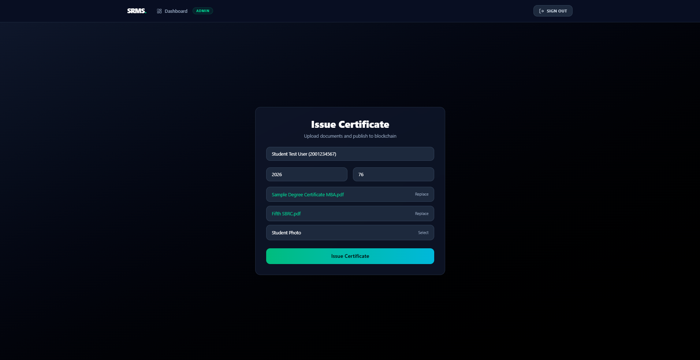 | 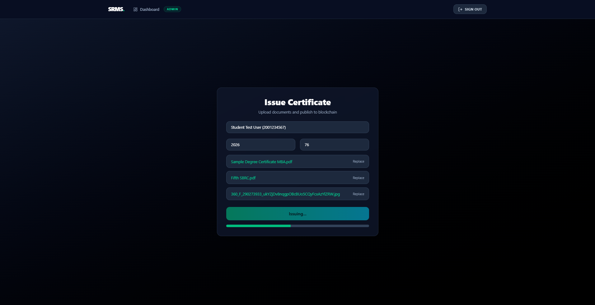 |

| Issue Success & QR Code |
|-------------------------|
| 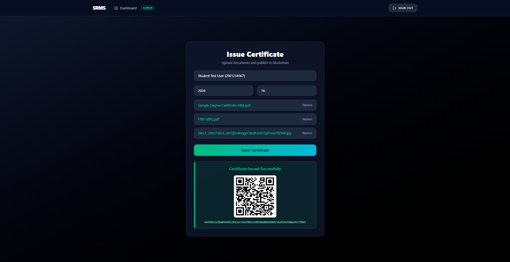 |

---

## 📂 Admin – Records Management

| Records Table | View Record Modal |
|---------------|-------------------|
| 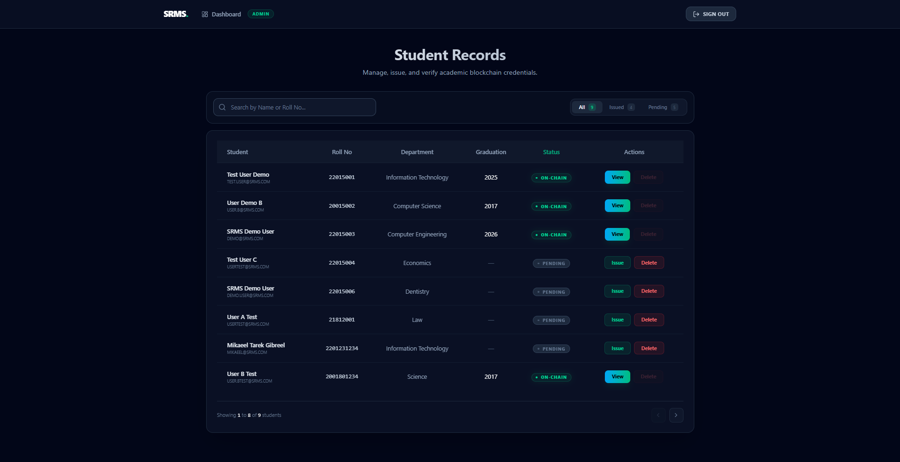 | 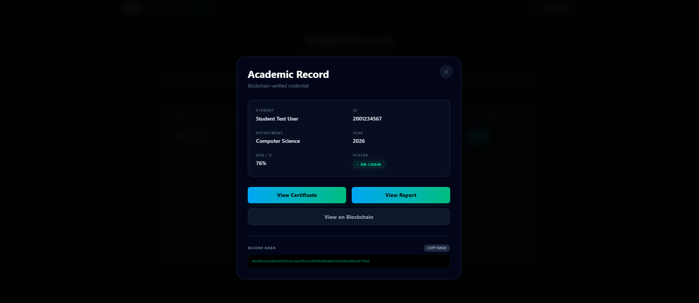 |

| Delete Confirmation |
|---------------------|
| 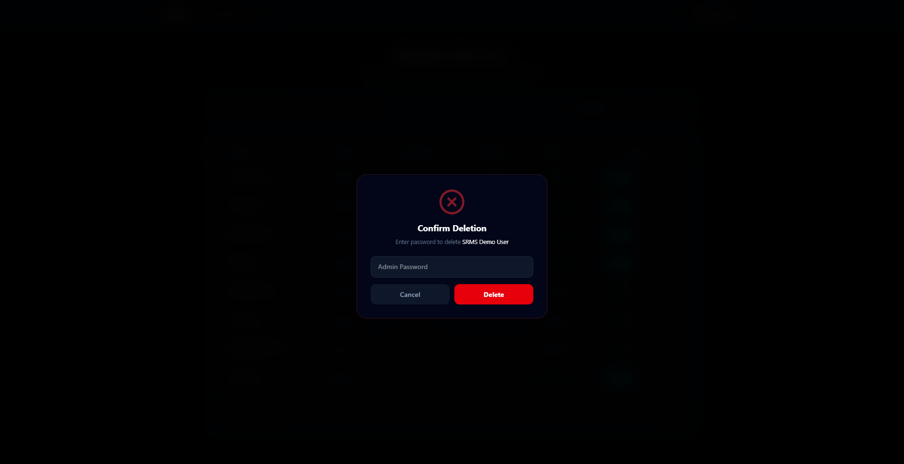 |

---

## 🎓 Student Dashboard

| Student Dashboard | View QR Code |
|-------------------|--------------|
| 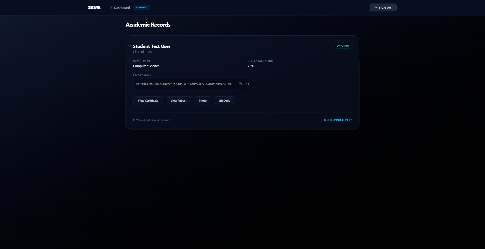 |  |

---

## 🔍 Public Certificate Verification

| Verification Page | Verification Input |
|-------------------|--------------------|
|  | 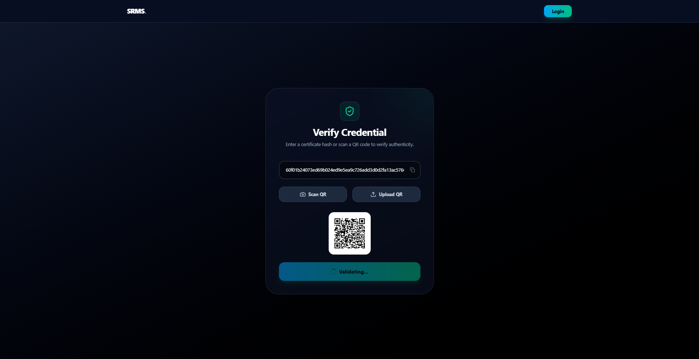 |

| Verification Success | Verification Failure |
|----------------------|----------------------|
| 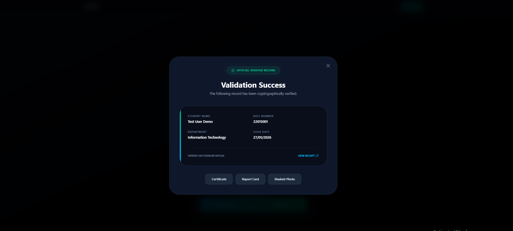 | 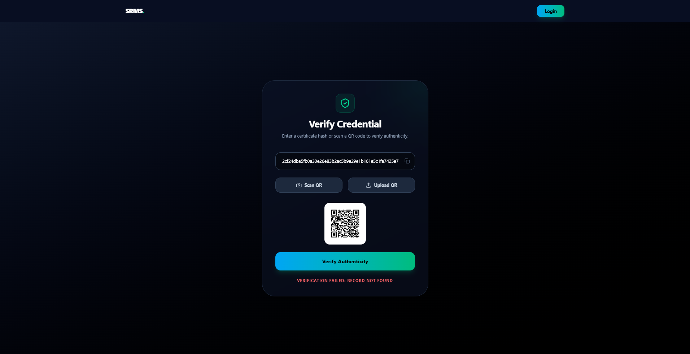 |

---

### Notes
- Screenshots contain sample data only
- No real student information is exposed
- Blockchain transactions are performed on the Ethereum Sepolia testnet

## 🧱 System Architecture

- Frontend: React + TypeScript + Tailwind CSS
- Backend: Node.js + Express + TypeScript
- Database: MongoDB
- Blockchain: Ethereum (Sepolia testnet)
- Smart Contracts: Solidity

---

## Why Blockchain?
- Traditional academic record systems are:
  - Centralized
  - Vulnerable to tampering
  - Difficult to verify across institutions

- This system levrages blockchain to:
  - Guarantee immutability of credentials
  - Enable public, trustless verification
  - Prevent fraud without exposing sensitive documents

## 🔐 Security Model

- Role-based access control (Admin / Student) (JWT)
- Blockchain write operations restricted to admin wallet
- Verifiers do not require authentication
- Documents are not stored on-chain (only hashes)

---

## ⚙️ Environment Setup

### Prerequisites
- Node.js (v18+)
- MongoDB
- MetaMask
- Sepolia ETH
- Alchemy or Infura RPC endpoint

---

### Backend Setup
- cd srms-backend
- npm install
- npm run dev

Create .env file:

- MONGO_URI=your_mongo_uri
- JWT_SECRET=your_secret
- PRIVATE_KEY=admin_wallet_private_key
- SEPOLIA_RPC_URL=your_rpc_url
- CONTRACT_ADDRESS=deployed_contract_address

---

### Smart Contracts
- cd srms-contracts
- npx hardhat compile
- npx hardhat deploy --network sepolia

---

### Frontend
- cd srms-frontend
- npm install
- npm run dev

---

## Verification Flow
1. Admin issues certificate
2. System generates:
    - Document hashes
    - Blockchain transaction
    - QR code
3. Verifier submits QR code or certificate hash
4. System validates authenticity from blockchain

---
## Use Case Summary
- Admin issues certificates
- Student accesses academic records
- Verifier validates certificates publicly

